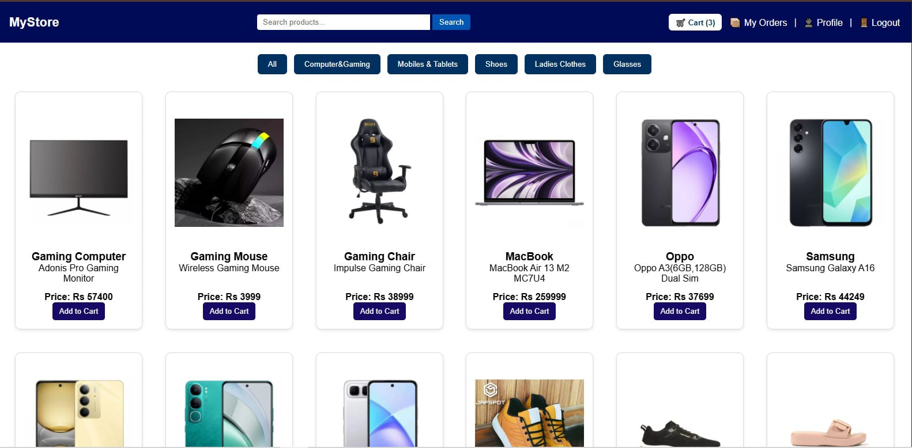
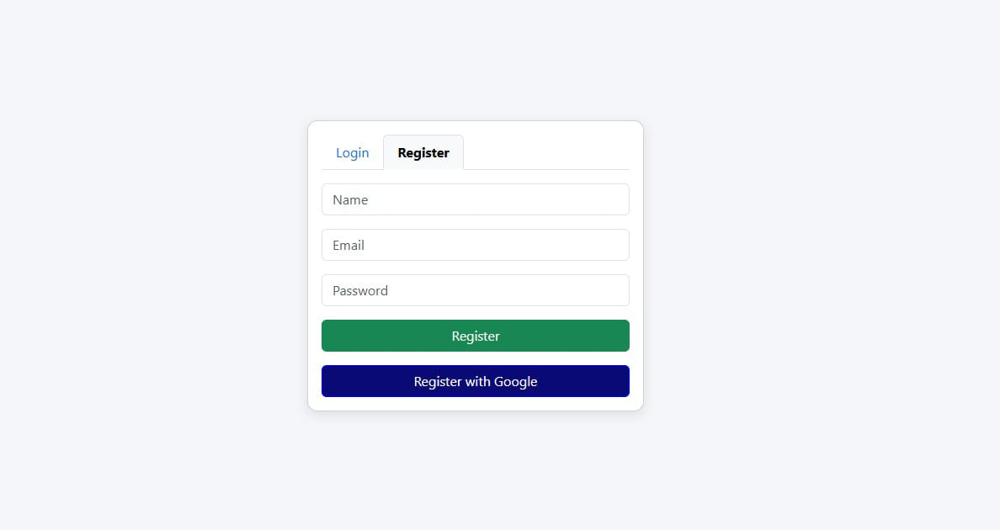
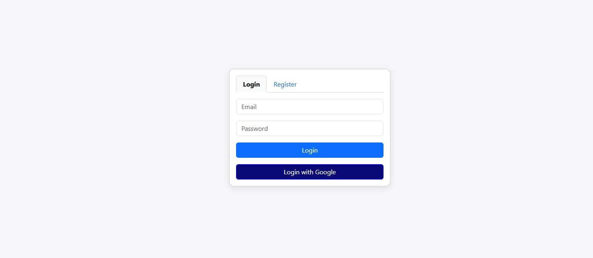
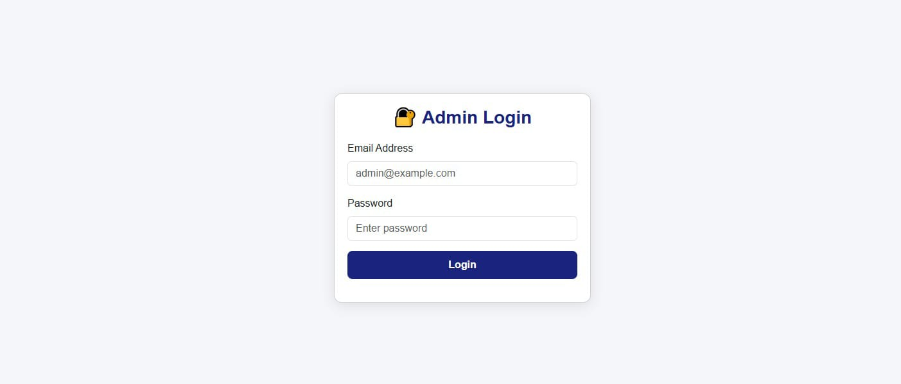
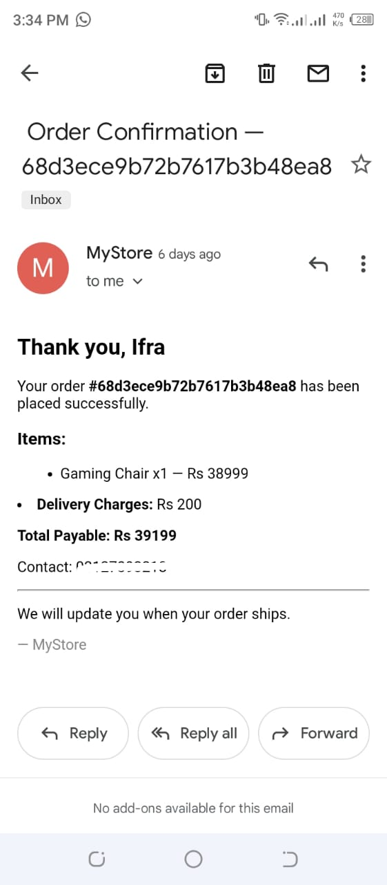

# 🛍️ MyStore — Full Stack E-Commerce Platform

<div align="center">


**A production-ready e-commerce platform with real-time order management,
secure authentication, and a powerful admin dashboard.**


</div>

---

## 🎯 Overview

MyStore is a *fully functional e-commerce web application* built from scratch using
Node.js and MongoDB. It supports complete shopping workflows — from browsing products
to checkout — with a dedicated admin panel for store management.

> 💡 Built as a complete full-stack project demonstrating real-world development skills.

---

## ✨ Features

### 🧑‍💻 Customer Experience
| Feature | Description |
|--------|-------------|
| 🔐 Authentication | Register, login with secure sessions |
| 🛒 Shopping Cart | Add, remove, update quantities in real-time |
| 📦 Order Management | Place orders & track order history |
| 📧 Email Notifications | Automated confirmation emails on order |
| 💳 Payment Options | EasyPaisa, Cash on Delivery |
| 📱 Responsive Design | Works on mobile, tablet & desktop |

### ⚙️ Admin Dashboard
| Feature | Description |
|--------|-------------|
| ➕ Product Management | Add, edit, delete products & categories |
| 👥 User Management | View and manage all registered users |
| 📋 Order Tracking | Update order status (Pending → Delivered) |
| 📄 PDF Export | Export orders as downloadable PDF |
| 📊 Sales Overview | Monitor store activity and orders |

---

## 🛠️ Tech Stack
```
Frontend   →  HTML, CSS, JavaScript
Backend    →  Node.js, Express.js
Database   →  MongoDB
Auth       →  Firebase Authentication
Email      →  Formspree
Version    →  Git & GitHub
```
---

## 📸 Screenshots

### 🏪 Product Catalog





### 🔐 Login 





### 🔐 Register





### ⚙️ Admin Panel





### 📄 Order Confirmation Email





---

## ⚙️ Installation


# 1. Clone the repository
```
git clone https://github.com/ifra489/E-commerce.git
```
# 2. Navigate to project
```
cd e-commerce-main
```
# 3. Install backend dependencies
```
cd server
```
```
npm install
```
# 4. Install frontend dependencies
```
cd ../client
```
```
npm install
```
# 5. Setup environment variables

```
cp .env.example .env
```
# Add your MongoDB URI, Firebase keys etc.

# 6. Start backend server
```
cd server
```
```
node index.js
```
# 7. Start frontend
```
cd ../client
```
```
npm run dev
```
🌐 Open in browser: http://localhost:5173

🔐 Environment Variables

Create .env file in /server:
```
PORT=5000
MONGODB_URI=your_mongodb_connection_string
JWT_SECRET=your_jwt_secret
```

📁 Project Structure
```
mystore-ecommerce/
│
├── client/                 # Frontend
│   ├── index.html
│   ├── src/
│   │   ├── pages/
│   │   ├── components/
│   │   └── assets/
│
├── server/                 # Backend
│   ├── index.js
│   ├── routes/
│   ├── models/
│   └── controllers/
│
└── README.md
```

## 👩‍💻 About the Developer

Ifra — Full Stack Developer | BSIT Student
Passionate about building real-world web applications

with clean code and great user experience.

## 📄 License
This project is open source under the MIT License.
